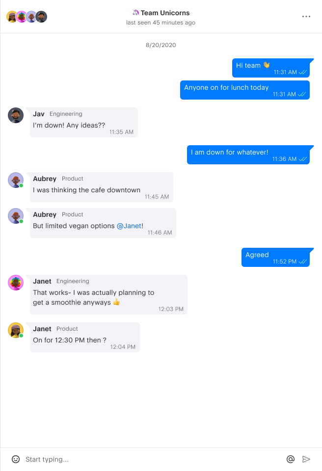

# vue2-homework-part3

## Задание

Необходимо реализовать чат на Vue2 используя только `render`-функции, то есть в компонентах должна отсутствовать секция `template`.

Что требуется:
 - Сделать самостоятельно декомпозицию чата на компоненты.
 - Выполнить верстку в точности как в [макете Figma](https://www.figma.com/file/cVJMc30VR4Mu84dIAj7bUh/Chat-UI-kit-(Community)). Максимальная ширина чата `41rem`. Минимальную ширину определите сами.
 - Связать компоненты между собой `render`-функциями.
 - Добавить демо логику для чата. См. Функции чата.

Функции чата:
 - Должна быть возможность оправлять текстовые сообщение. После отправки сообщение отображается сразу в чате.
 - Каждые `10сек` Вам должно приходить сообщение от тестового пользователя с любым текстом.

Необязательно:
- Можно не использовать `tailwindcss`. По умолчанию он подключен.

В проекте должны без ошибок выполняться команды `npm run build` и `npm run preview`.

Рабочие материалы:
- [Макет чата Figma](https://www.figma.com/file/cVJMc30VR4Mu84dIAj7bUh/Chat)
- [Документация по функции `h`](https://ru.vuejs.org/v2/guide/render-function.html#%D0%90%D1%80%D0%B3%D1%83%D0%BC%D0%B5%D0%BD%D1%82%D1%8B-createElement)
- [Tailwindcss v3](https://tailwindcss.com/)

Скрин макета:

